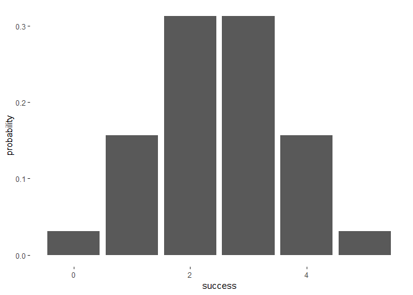

<!-- README.md is generated from README.Rmd. Please edit that file -->
Overview
--------

`"binomial"` is a minimal [R](http://www.r-project.org/) package that provides functions to calculate probabilites of a Binomial random variable.

-   `bin_variable` creates a coin object (of class `"binvar"`)
-   `bin_probability()` calculates a binomial probability.
-   `bin_distribution()` creates a `bindis` object, a binomial distribution.
-   `bin_cumulative()` creates a `bincum` object, a cumulative binomial distribution.
-   `plot()` method for a `"bindis"` or `"bincum"`object to plot graphs of the distribution.
-   `bin_choose()` calculates the number of combinations of determined number of successes and trials.
-   `summary()` method for a `"binvar"` object.

Motivation
----------

This package has been developed to practice some of the concepts behind the creation of an R package.

Installation
------------

Install the development version from GitHub via the package `"devtools"`:

``` r
# development version from GitHub:
#install.packages("devtools") 
# install "binomial" (without vignettes)
devtools::install_github("nahyungkim1220/binomial")
# install "binomial" (with vignettes)
devtools::install_github("nahyungkim1220/binomial", build_vignettes = TRUE)
```

Usage
-----

``` r
library(binomial)
library(ggplot2)
# binvar
bin1 <- bin_variable(trials = 10, p = 0.3)
bin1
#> "Binomial variable" 
#> 
#> Parameters 
#> - number of trials: 10 
#> - prob of success: 0.3
# summary
binsum1 <- summary(bin1)
binsum1
#> "Summary Binomial" 
#> 
#> Parameters 
#> - number of trials: 10 
#> - prob of success: 0.3 
#> 
#> Measures 
#> - mean: 3 
#> - variance: 2.1 
#> - mode: 3 
#> - skewness: 0.2760262 
#> - kurtosis -0.1238095
# bin_probability
bin_probability(success = 2, trials = 5, prob = 0.5)
#> [1] 0.3125
# bindis
dis <- bin_distribution(trials = 5, prob = 0.5)
dis
#>   success probability
#> 1       0     0.03125
#> 2       1     0.15625
#> 3       2     0.31250
#> 4       3     0.31250
#> 5       4     0.15625
#> 6       5     0.03125
# plot bindis
plot(dis)
#> Warning: Ignoring unknown parameters: binwidth, bins, pad
```



``` r
#bin_choose
bin_choose(n = 5, k = 2)
#> [1] 10
```
